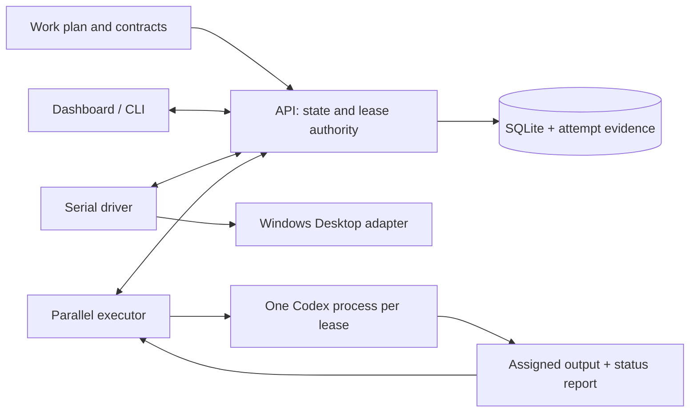

# Architecture

Protocol Runner preserves a declared procedure across workers and interruptions.
The work plan owns ordering and transitions. A referenced contract owns the purpose,
method, output shape and review criteria. The coordinator chooses those inputs and
accepts or rejects the substantive result.

## Components

The **core** is pure TypeScript. It validates plans, renders the current assignment,
parses structured reports and resolves declared transitions. It does not make HTTP
requests, choose a research method or inspect whether a conclusion is true.

The **API** snapshots the plan and is the sole writer of run state. It owns binding,
preflight, leases, report acceptance, events and closeout. New public runs use the
SQLite store, backed by `sql.js`; JSON storage remains in the implementation for its
existing recovery/compatibility scope. File artifacts retain prompts, process
records, status reports and attempt results. These records answer different questions
and are not interchangeable proofs of success.

The **serial driver** polls eligible runs and asks the API to dispatch the current
step. The Windows integration selects an explicitly bound visible conversation.
A matching start report establishes receipt for the current prompt attempt; a
separate return report supplies completion status. Transcript inspection and visible
UI inspection are diagnostic routes, not replacements for the normal report flow.

The **parallel executor** receives leases for the current group. Each item has an
input, contract and output target. A lease selects one item and one attempt; the
executor cannot invent additional plan steps. The real launcher runs `codex exec`,
captures output and process evidence, and submits the result to the API. The fake
launcher exercises the same executor/API path without a model.

The **dashboard** and **CLI** read state and invoke API operations. They do not mutate
SQLite or independently decide which transitions are legal.

## Run, item, attempt and lease are different identities

A run has a current outer step. A parallel group is one such step, with several
independent items. An item may need more than one attempt. A lease authorizes an
executor to run one specific attempt for a bounded time.

When an attempt times out, it remains evidence of that execution. An explicit retry
creates a new attempt for the selected item. Completed sibling items remain complete.
Preflight checks the pending launch set's output targets while preserving the
group-wide plan and storage checks. It refuses to overwrite an existing target just
because a retry was requested.

Expired leases do not universally mean that a process is dead. The implementation
can requeue a never-started attempt only when its attempt directory is absent.
An existing directory or ambiguous evidence requires recovery. This conservative
boundary avoids making a second launch appear safe simply because a timer expired.

See [the recovery example](../examples/recovery/work_plan.json) and
[HTTP regression cases](../services/protocol-runner-api/src/server.test.ts) for the
item-scoped behavior. The demo injects a timeout; it does not kill a real process.

## Execution modes and dependencies

The schema's `serial` mode is for dependent work in a continuing Desktop conversation.
The `mixed` mode permits serial steps and parallel groups; a plan containing only
parallel groups also uses `mixed` and a `parallel_only` binding. The schema name does
not imply that the demo depends on Desktop.

The portable public stack includes the API, executor and browser dashboard. Serial
and mixed Desktop work additionally use the optional Windows adapter and relay code.
Those services have their own authentication, application-state and visible-session
requirements. They are not started as part of the credential-free recovery demo.
See the [Windows setup guide](windows-desktop.md).

Artifact-only workers read from the selected workspace and write assigned outputs.
Source-writer groups instead declare an exact Git base and disjoint owned paths.
The source-workspace support prepares a separate attempt workspace, preserves a Git
contribution and bundle, and makes handoff explicit before cleanup. Importing and
accepting that contribution remains a coordinator action. See
[source-writing workers](source-workspaces.md) for setup and lifecycle details.

## Public operating boundary

The API is local and requires a control token. The startup script binds services to
loopback; the browser talks through a local proxy that supplies the API credential.
Worker inputs, outputs and operational data can contain sensitive information. Keep
them outside tracked source. [SECURITY.md](../SECURITY.md) defines the supported
boundary and worker-permission defaults.

Contracts constrain assigned work but do not sandbox an adversarial process. A
completed procedural run also does not establish substantive correctness, a safe
deployment, or a publishable result. Those require evidence appropriate to that work.
